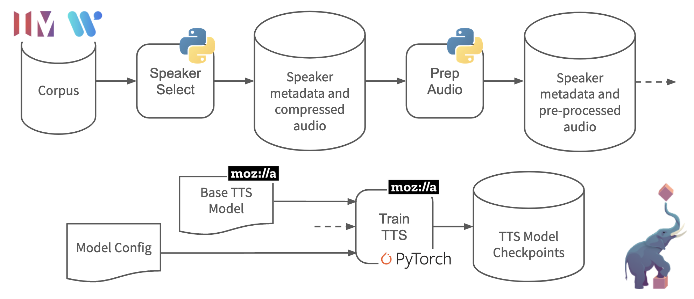

# Singlish speech synthesis using Tacotron2

This data pipeline and the included notebooks demonstrate the fine tuning of a TSS model for a local language/accent ([Singlish](https://en.wikipedia.org/wiki/Singlish)). The data pipeline utilizes audio/transcript data from the [IMDA National Speech Corpus](https://www.imda.gov.sg/NationalSpeechCorpus) and using [Mozilla's implementation of Tacotron2](https://github.com/mozilla/TTS).

After ensuring that you have the [pre-requisites](#pre-requisites), complete the following steps to deploy the Singlish pipeline:

1. [Prepare the input repository](#1-prepare-input-repository)
2. [Select a speaker and pre-process the corresponding data](#2-select-a-speaker-and-pre-process-the-corresponding-data)
3. [Train the TTS model](#3-train-the-tts-model)
4. [Try using the TTS model to synthesize speech](#4-try-synthesizing-speech-with-your-new-model)

## Pre-requisites

To run this pipeline you should first:

- Request access to the [IMDA National Speech Corpus](https://www.imda.gov.sg/NationalSpeechCorpus)
- Deploy a GPU enabled [Pachyderm](https://pachyderm.io/) cluster or create a cluster in the hosted [Pachyderm:Hub](https://hub.pachyderm.com/clusters) (The pipeline has been tested with V100 and K80 GPUs on Google Cloud)
- [Install `pachctl` locally](https://docs.pachyderm.com/latest/getting_started/local_installation/#install-pachctl) and connect it to your Pachyderm cluster

## 1. Prepare input repository

Pachyderm data pipelines utilize a versioned data storage layer backed by an object store. Data is organized into "data repositories" (repos) in this storage layer. To utilize the IMDA corpus in our data pipeline, we need to create an input repo, `corpus`, for this data and upload the data into the repo. For this example deploy, we will just be using `PART2` of the IMDA National Speech Corpus. Once created, your input repository should look like the following:

```sh
$ pachctl list file corpus@master:/
NAME           TYPE SIZE
/SCRIPT        dir  79.4MiB
/WAVE          dir  86.83GiB
/speakers.XLSX file 59.98KiB

$ pachctl list file corpus@master:/WAVE | head
NAME                  TYPE SIZE
/WAVE/SPEAKER2001.zip file 87.08MiB
/WAVE/SPEAKER2002.zip file 93.38MiB
/WAVE/SPEAKER2003.zip file 76.99MiB
/WAVE/SPEAKER2005.zip file 36.53MiB
/WAVE/SPEAKER2006.zip file 61.53MiB
/WAVE/SPEAKER2007.zip file 92.24MiB
/WAVE/SPEAKER2008.zip file 81.92MiB
/WAVE/SPEAKER2009.zip file 65.67MiB
/WAVE/SPEAKER2010.zip file 76.23MiB

$ pachctl list file corpus@master:/SCRIPT | head
NAME               TYPE SIZE
/SCRIPT/020010.TXT file 43.46KiB
/SCRIPT/020011.TXT file 43.91KiB
/SCRIPT/020020.TXT file 41.75KiB
/SCRIPT/020021.TXT file 40.09KiB
/SCRIPT/020030.TXT file 44.02KiB
/SCRIPT/020031.TXT file 40.5KiB
/SCRIPT/020050.TXT file 42.06KiB
/SCRIPT/020060.TXT file 34.96KiB
/SCRIPT/020061.TXT file 36.68KiB
```  

## 2. Select a speaker and pre-process the corresponding data

We will be fine-tuning an existing TTS model from Mozilla and thus we won't need as much data as we would if we were training from scratch. As such, we will just be selecting the audio and transcript files out of the IMDA corpus that correspond to a particular speaker. The IMDA corpus includes many male and female speakers with Chinese, Indian, and Malay accents. For our example we will utilize a female speaker with an Indian accent. 

The [`speaker_select.py` Python script](speaker_select/speaker_select.py) performs the necessary filtering of the corpus. It also reformat's IMDA's metadata and transcript information into [LJSpeech](https://keithito.com/LJ-Speech-Dataset/) format. We utilize the LJSpeech format because we will be using an base model trained on LJSpeech and because Mozilla's TTS implementation already has a pre-processor for LJSpeech formatted data.   

To filter the corpus for a female speaker with Indian accent, for example, you would run:

```sh
$ python speaker_select.py \
    --docfile <path to IMDA's speaker file> \
    --gender F --acc INDIAN \
    --scriptdir <path to the IMDA SCRIPT directory> \
    --wavdir <path to the IMDA WAVE directory> 
    --numspeakers 1 --outdir <output directory>
```

To run this in our Pachyderm cluster on the `corpus` repo we Dockerize the script with [this Dockerfile](speaker_select/Dockerfile). The resulting image is available publicly on Docker Hub as `dwhitena/tts-speaker-select`.

Using that Docker image, we create the `speaker_select` pipeline in our Pachyderm cluster using `pachctl` and the [`speaker_select.json` pipeline specification](speaker_select.json):

```sh
$ pachctl create pipeline -f speaker_select.json
```

This will automatically trigger a "job" to process the corpus data and output the filtered data to the `speaker_select` repo:

```sh
$ pachctl list job --no-pager --pipeline speaker_select
ID                               PIPELINE       STARTED      DURATION   RESTART PROGRESS  DL       UL       STATE
bcea6c90cb5a43e5b6f1cf6a206e50fa speaker_select 21 hours ago 15 seconds 0       1 + 0 / 1 79.46MiB 83.47KiB success

$ pachctl list file speaker_select@master:/
NAME             TYPE SIZE
/SPEAKER3162.zip file 94.07MiB
/metadata.csv    file 83.47KiB
```  

Great! We now have our filtered corpus data. However, it is still in a `*.zip` file. To finish our pre-processing, we need to extract the WAV files from the zip file and organize them in the LJSpeech format. This is done with a second pipeline called `prep_audio`. `prep_audio` run the [`prep_audio.py` script](prep_audio/prep_audio.py) and is created using the [`prep_audio.json` pipeline specification](prep_audio.json):

```sh
$ pachctl create pipeline -f prep_audio.json

$ pachctl list job --no-pager --pipeline prep_audio
ID                               PIPELINE   STARTED      DURATION   RESTART PROGRESS  DL       UL       STATE
4b3b251db5e54a8cbe76717d7b29884d prep_audio 20 hours ago 11 seconds 0       1 + 0 / 1 94.15MiB 122.7MiB success

$ pachctl list file prep_audio@master:/
NAME          TYPE SIZE
/metadata.csv file 83.47KiB
/wavs         dir  122.6MiB

$ pachctl list file prep_audio@master:/wavs | head
NAME                TYPE SIZE
/wavs/031620002.wav file 152.5KiB
/wavs/031620003.wav file 121.9KiB
/wavs/031620004.wav file 201KiB
/wavs/031620005.wav file 122.9KiB
/wavs/031620006.wav file 71.57KiB
/wavs/031620007.wav file 113.2KiB
/wavs/031620008.wav file 110.7KiB
/wavs/031620009.wav file 141.3KiB
/wavs/031620010.wav file 128.2KiB
```

## 3. Train the TTS model

The data is now ready for training. We will utilize [Mozilla's implementation of Tacotron2](https://github.com/mozilla/TTS) to perform our training and inference. We will also start from [one of their pre-trained models](https://github.com/mozilla/TTS/wiki/Released-Models) as our base model (which will reduce training time drastically).

We will need the [config file](config.json) for training, so let's go ahead and upload that into a Pachdyerm repo:

```sh
$ pachctl create repo config

$ pachctl put file config@master:/config.json -f config.json

$ pachctl list file config@master:/config.json
NAME         TYPE SIZE
/config.json file 4.619KiB
```

Then we can start training by creating the `train_tts` pipeline with the [`train_tts.json` pipeline specification](train_tts.json):

```sh
$ pachctl create pipeline -f train_tts.json

$ pachctl list job --no-pager --pipeline train_tts

$ pachctl list job --no-pager --pipeline train_tts
ID                               PIPELINE  STARTED     DURATION RESTART PROGRESS  DL UL STATE
d34b3035736d48a98536365d19e76edf train_tts 5 hours ago -        0       0 + 0 / 1 0B 0B running
``` 

Once that finishes running, you should be able to view and download the checkpoints from the `train_tts` repo (the output repo from the `train_tts` pipeline):

```sh
$ blah
```

## 4. Try synthesizing speech with your new model!

Once you have completed the above pipeline (or if you already have a pre-trained model), you can use [this Google Colab notebook](https://colab.research.google.com/drive/1doD9XCtfF2enMV2UXohLQCeqMplDFUjh) to interatively synthesize speech. 

## Ideas for improving the model/pipeline

This is meant to be a demo pipeline and there could definitely be improvements if you actually wanted to utilize it in some system. Try:

- Utilizing more than one speaker from IMDA, but all with the same gender and accent. Adding more data will likely allow the model to generalize beter.
- Utilize a base model trained on more than one speaker/language.
- Try mixed fine tuning by mixing the LJSpeech corpus with the data from IMDA.

## References

- [Mozilla TTS (Tacotron2) Implementation](https://github.com/mozilla/TTS)
- [Pachyderm](https://pachyderm.io/) 
- [Tacotron2 Paper](https://arxiv.org/abs/1712.05884) 
- [WaveNet Blog Post](https://deepmind.com/blog/article/wavenet-generative-model-raw-audio) 
- [SIL](https://www.sil.org/) 
- [Wordly](https://wordly.sg/) 
- [IMDA Singlish Corpus](https://www.imda.gov.sg/NationalSpeechCorpus) 

